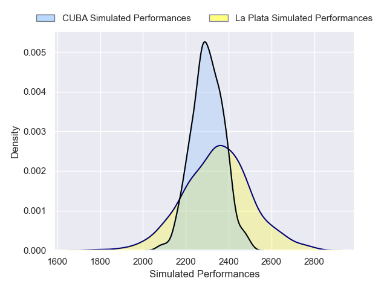
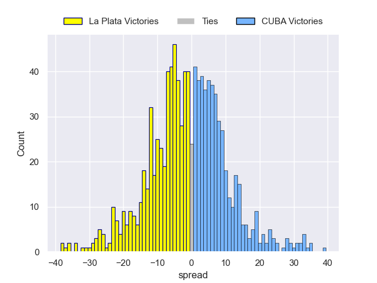

---  
layout: page  
title: La Plata V CUBA on 2025/10/11  
date: 2025-10-11  
categories: "URBA Top 13 2025" match projection  
---
# La Plata V CUBA on 2025/10/11, 28.0 to 33.0

# Club Level Predictions

Now that the game has been played, lets see how the club predictions did. I predicted CUBA to win by 1.08, and CUBA won by 5.0. That's an absolute error of 3.9 for the margin of victory, while my average absolute error has been 14.1 over the past six months. This prediction was more accurate than 81.4% of my recent predictions.

For the Over/Under model, I predicted a total of 52.5 and we have an actual total of 61.0. That's an absolute error of 8.5 compared to a six month average of 13.7. This prediction was more accurate than 61.0% of my recent predictions.
## Projected Performances - Club Model

## Projected Spreads - Club Model

## Projected Results - Club Model

