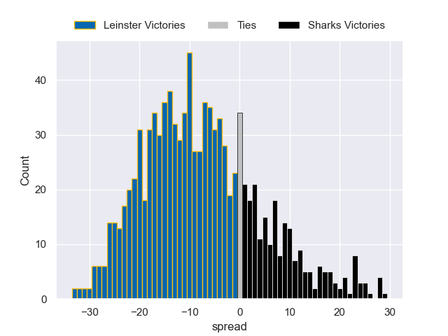

---  
layout: page  
title: Leinster V Sharks on 2025/10/11  
date: 2025-10-11  
categories: "United Rugby Championship 25/26" match projection  
---
# Leinster V Sharks on 2025/10/11, 31.0 to 5.0

# Club Level Predictions

Now that the game has been played, lets see how the club predictions did. I predicted Leinster to win by 7.24, and Leinster won by 26.0. That's an absolute error of 18.8 for the margin of victory, while my average absolute error has been 14.1 over the past six months. This prediction was more accurate than 27.2% of my recent predictions.

For the Over/Under model, I predicted a total of 45.5 and we have an actual total of 36.0. That's an absolute error of 9.5 compared to a six month average of 13.8. This prediction was more accurate than 57.3% of my recent predictions.
## Projected Performances - Club Model

## Projected Spreads - Club Model

## Projected Results - Club Model

