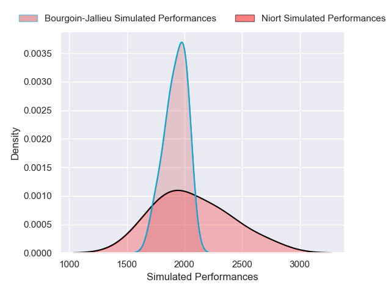
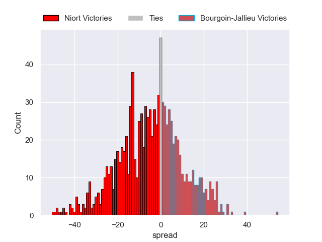

---  
layout: page  
title: Niort V Bourgoin-Jallieu on 2025/10/11  
date: 2025-10-11  
categories: "Nationale 25/26" match projection  
---
# Niort V Bourgoin-Jallieu on 2025/10/11, 49.0 to 16.0

# Club Level Predictions

Now that the game has been played, lets see how the club predictions did. I predicted Niort to win by 3.48, and Niort won by 33.0. That's an absolute error of 29.5 for the margin of victory, while my average absolute error has been 14.1 over the past six months. This prediction was more accurate than 10.0% of my recent predictions.

For the Over/Under model, I predicted a total of 41.5 and we have an actual total of 65.0. That's an absolute error of 23.5 compared to a six month average of 13.7. This prediction was more accurate than 16.8% of my recent predictions.
## Projected Performances - Club Model

## Projected Spreads - Club Model

## Projected Results - Club Model

