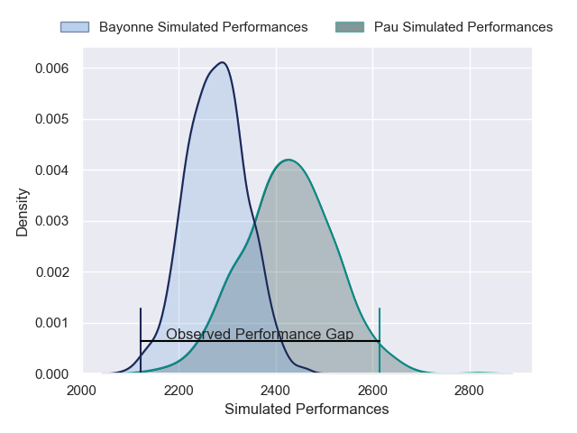
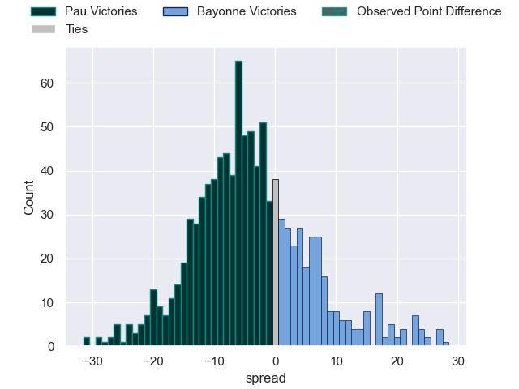

---  
layout: page  
title: Pau V Bayonne on 2025/10/11  
date: 2025-10-11  
categories: "Top 14 25/26" match projection  
---
# Pau V Bayonne on 2025/10/11, 47.0 to 24.0

# Club Level Predictions

Now that the game has been played, lets see how the club predictions did. I predicted Pau to win by 3.89, and Pau won by 23.0. That's an absolute error of 19.1 for the margin of victory, while my average absolute error has been 14.0 over the past six months. This prediction was more accurate than 26.5% of my recent predictions.

For the Over/Under model, I predicted a total of 50.5 and we have an actual total of 71.0. That's an absolute error of 20.5 compared to a six month average of 13.9. This prediction was more accurate than 22.6% of my recent predictions.
## Projected Performances - Club Model

## Projected Spreads - Club Model

## Projected Results - Club Model

