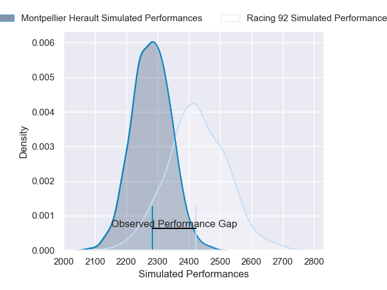
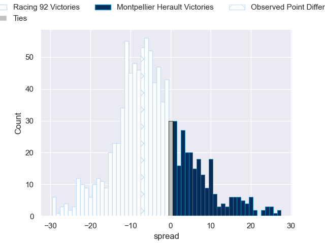

---  
layout: page  
title: Racing 92 V Montpellier Herault on 2025/10/11  
date: 2025-10-11  
categories: "Top 14 25/26" match projection  
---
# Racing 92 V Montpellier Herault on 2025/10/11, 32.0 to 25.0

# Club Level Predictions

Now that the game has been played, lets see how the club predictions did. I predicted Racing 92 to win by 4.63, and Racing 92 won by 7.0. That's an absolute error of 2.4 for the margin of victory, while my average absolute error has been 14.1 over the past six months. This prediction was more accurate than 88.8% of my recent predictions.

For the Over/Under model, I predicted a total of 47.5 and we have an actual total of 57.0. That's an absolute error of 9.5 compared to a six month average of 13.8. This prediction was more accurate than 57.3% of my recent predictions.
## Projected Performances - Club Model

## Projected Spreads - Club Model

## Projected Results - Club Model

