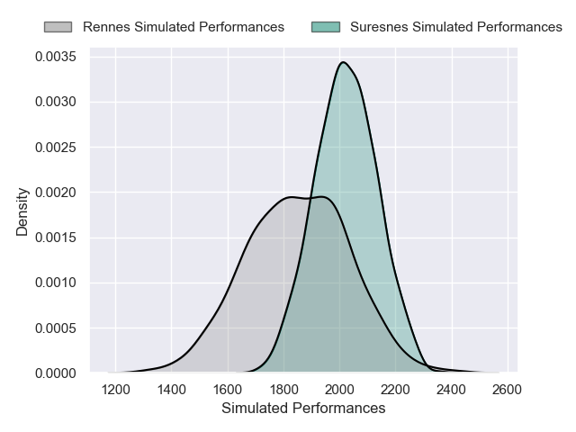
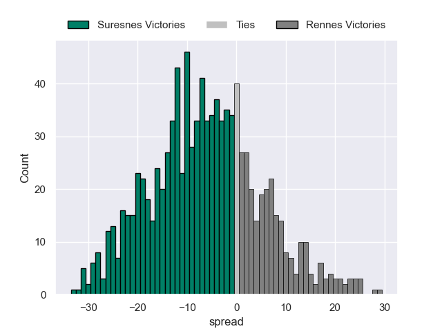

---  
layout: page  
title: Suresnes V Rennes on 2025/10/11  
date: 2025-10-11  
categories: "Nationale 25/26" match projection  
---
# Suresnes V Rennes on 2025/10/11, 12.0 to 14.0

# Club Level Predictions

Now that the game has been played, lets see how the club predictions did. I predicted Suresnes to win by 5.61, and Rennes won by 2.0. That's an absolute error of 7.6 for the margin of victory, while my average absolute error has been 14.1 over the past six months. This prediction was more accurate than 63.3% of my recent predictions.

For the Over/Under model, I predicted a total of 37.5 and we have an actual total of 26.0. That's an absolute error of 11.5 compared to a six month average of 13.7. This prediction was more accurate than 48.9% of my recent predictions.
## Projected Performances - Club Model

## Projected Spreads - Club Model

## Projected Results - Club Model

