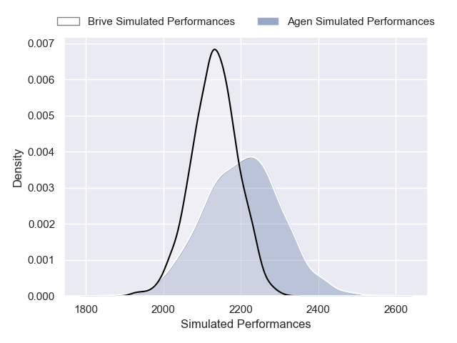
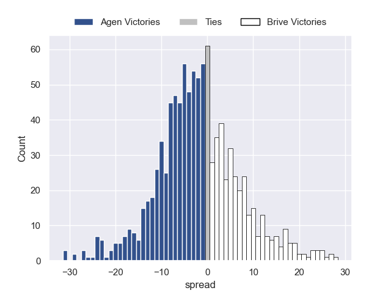

---  
layout: page  
title: Agen V Brive on 2025/10/17  
date: 2025-10-17  
categories: "Pro D2 25/26" match projection  
---
# Agen V Brive on 2025/10/17, 41.0 to 10.0

# Club Level Predictions

Now that the game has been played, lets see how the club predictions did. I predicted Agen to win by 1.92, and Agen won by 31.0. That's an absolute error of 29.1 for the margin of victory, while my average absolute error has been 13.9 over the past six months. This prediction was more accurate than 10.2% of my recent predictions.

For the Over/Under model, I predicted a total of 43.5 and we have an actual total of 51.0. That's an absolute error of 7.5 compared to a six month average of 13.7. This prediction was more accurate than 65.9% of my recent predictions.
## Projected Performances - Club Model

## Projected Spreads - Club Model

## Projected Results - Club Model

