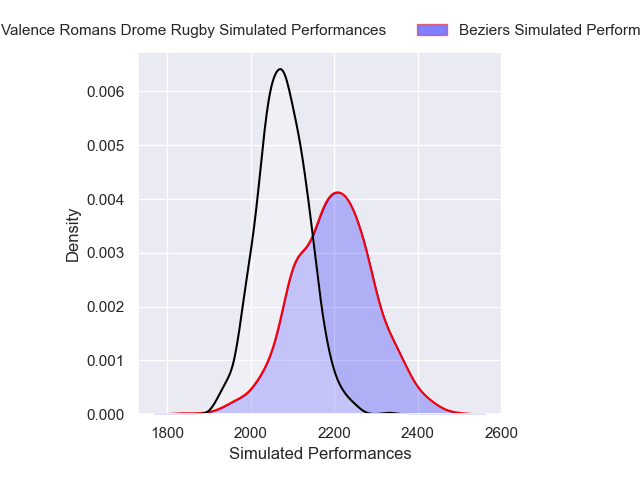
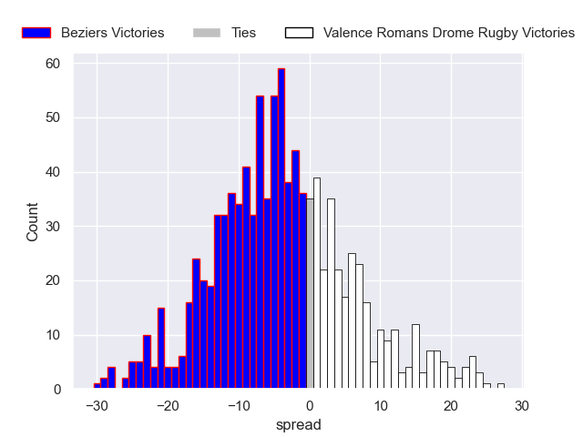

---  
layout: page  
title: Beziers V Valence Romans Drome Rugby on 2025/10/17  
date: 2025-10-17  
categories: "Pro D2 25/26" match projection  
---
# Beziers V Valence Romans Drome Rugby on 2025/10/17, 29.0 to 37.0

# Club Level Predictions

Now that the game has been played, lets see how the club predictions did. I predicted Beziers to win by 3.38, and Valence Romans Drome Rugby won by 8.0. That's an absolute error of 11.4 for the margin of victory, while my average absolute error has been 13.9 over the past six months. This prediction was more accurate than 47.4% of my recent predictions.

For the Over/Under model, I predicted a total of 47.5 and we have an actual total of 66.0. That's an absolute error of 18.5 compared to a six month average of 13.7. This prediction was more accurate than 27.4% of my recent predictions.
## Projected Performances - Club Model

## Projected Spreads - Club Model

## Projected Results - Club Model

