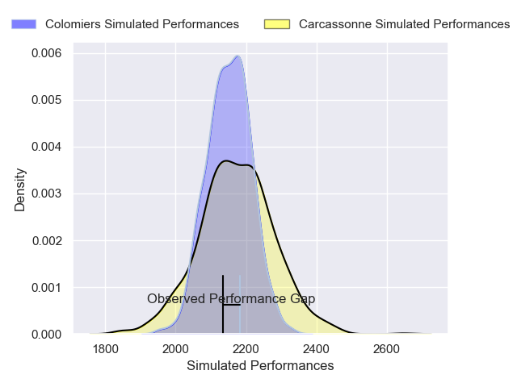
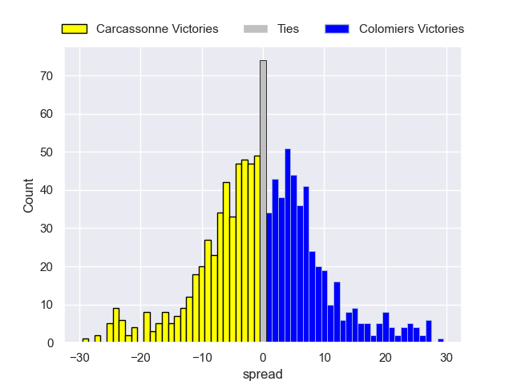

---  
layout: page  
title: Carcassonne V Colomiers on 2025/10/17  
date: 2025-10-17  
categories: "Pro D2 25/26" match projection  
---
# Carcassonne V Colomiers on 2025/10/17, 13.0 to 15.0

# Club Level Predictions

Now that the game has been played, lets see how the club predictions did. I predicted Carcassonne to win by 0.63, and Colomiers won by 2.0. That's an absolute error of 2.6 for the margin of victory, while my average absolute error has been 13.9 over the past six months. This prediction was more accurate than 87.6% of my recent predictions.

For the Over/Under model, I predicted a total of 44.5 and we have an actual total of 28.0. That's an absolute error of 16.5 compared to a six month average of 13.7. This prediction was more accurate than 32.8% of my recent predictions.
## Projected Performances - Club Model

## Projected Spreads - Club Model

## Projected Results - Club Model

