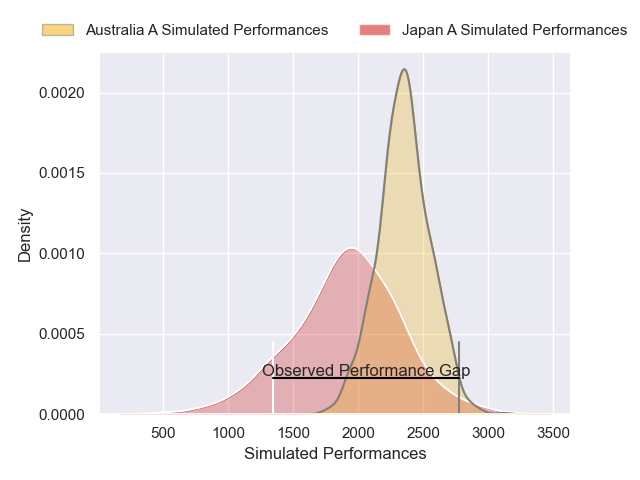
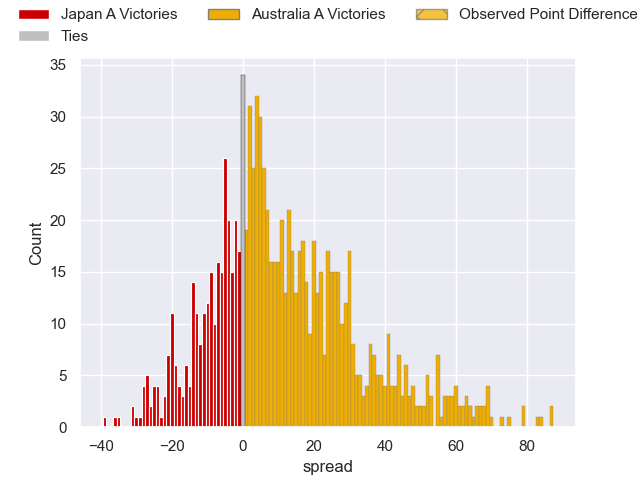

---  
layout: page  
title: Japan A V Australia A on 2025/10/17  
date: 2025-10-17  
categories: "International Test Match 2025" match projection  
---
# Japan A V Australia A on 2025/10/17, 7.0 to 71.0

# Club Level Predictions

Now that the game has been played, lets see how the club predictions did. I predicted Australia A to win by 10.64, and Australia A won by 64.0. That's an absolute error of 53.4 for the margin of victory, while my average absolute error has been 13.9 over the past six months. This prediction was more accurate than 1.5% of my recent predictions.

For the Over/Under model, I predicted a total of 57.5 and we have an actual total of 78.0. That's an absolute error of 20.5 compared to a six month average of 13.6. This prediction was more accurate than 22.4% of my recent predictions.
## Projected Performances - Club Model

## Projected Spreads - Club Model

## Projected Results - Club Model

