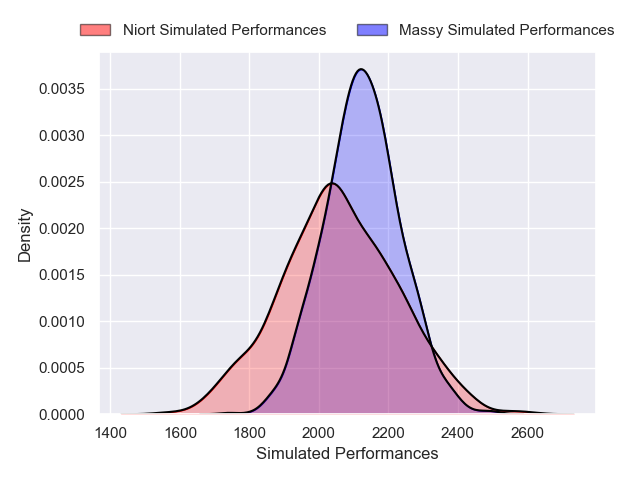
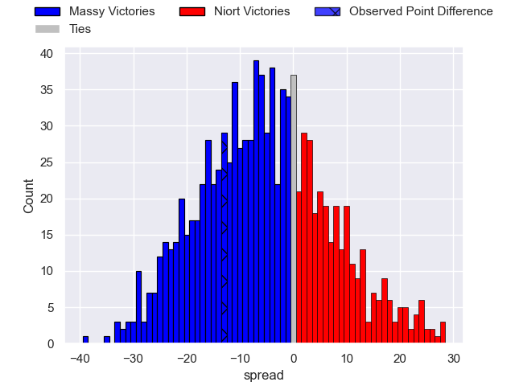
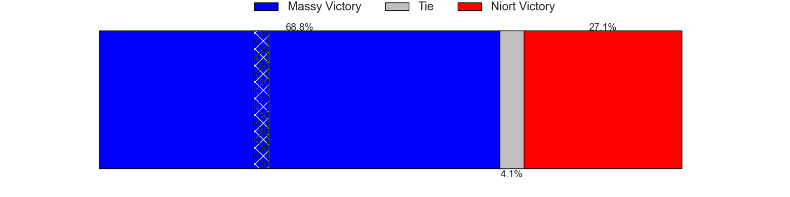

---  
layout: page  
title: Massy V Niort on 2025/10/17  
date: 2025-10-17  
categories: "Nationale 25/26" match projection  
---
# Massy V Niort on 2025/10/17, 29.0 to 16.0

# Club Level Predictions

Now that the game has been played, lets see how the club predictions did. I predicted Massy to win by 5.33, and Massy won by 13.0. That's an absolute error of 7.7 for the margin of victory, while my average absolute error has been 13.9 over the past six months. This prediction was more accurate than 62.6% of my recent predictions.

For the Over/Under model, I predicted a total of 43.5 and we have an actual total of 45.0. That's an absolute error of 1.5 compared to a six month average of 13.6. This prediction was more accurate than 93.0% of my recent predictions.
## Projected Performances - Club Model

## Projected Spreads - Club Model

## Projected Results - Club Model

