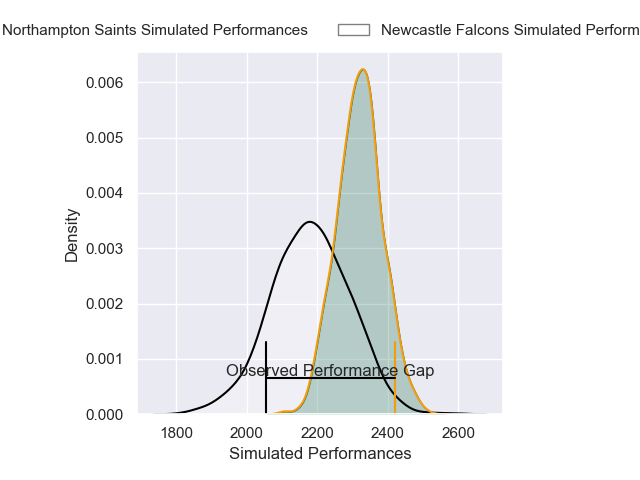
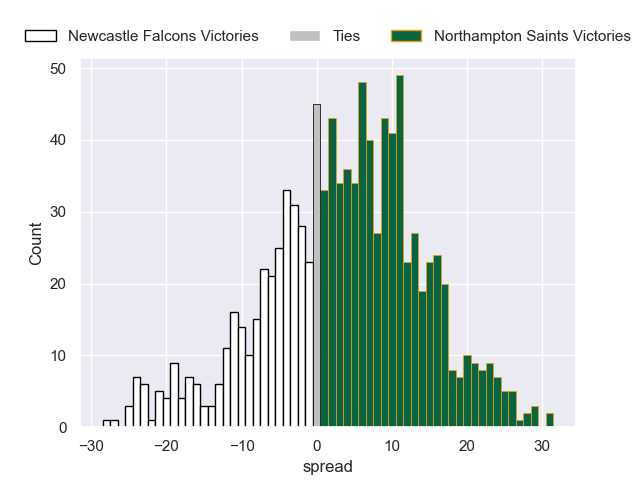
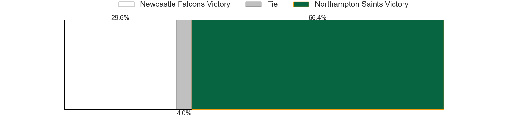

---  
layout: page  
title: Newcastle Falcons V Northampton Saints on 2025/10/17  
date: 2025-10-17  
categories: "Gallagher Premiership 25/26" match projection  
---
# Newcastle Falcons V Northampton Saints on 2025/10/17, 19.0 to 36.0

# Club Level Predictions

Now that the game has been played, lets see how the club predictions did. I predicted Northampton Saints to win by 4.19, and Northampton Saints won by 17.0. That's an absolute error of 12.8 for the margin of victory, while my average absolute error has been 13.9 over the past six months. This prediction was more accurate than 41.8% of my recent predictions.

For the Over/Under model, I predicted a total of 66.5 and we have an actual total of 55.0. That's an absolute error of 11.5 compared to a six month average of 13.7. This prediction was more accurate than 49.1% of my recent predictions.
## Projected Performances - Club Model

## Projected Spreads - Club Model

## Projected Results - Club Model

