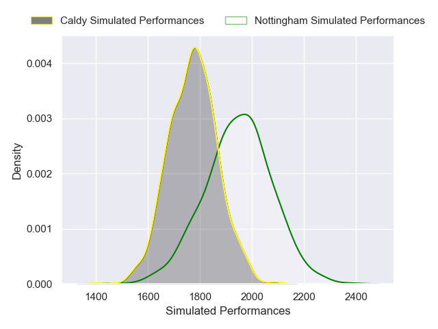
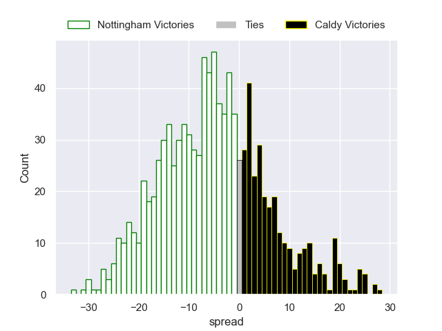

---  
layout: page  
title: Nottingham V Caldy on 2025/10/17  
date: 2025-10-17  
categories: "RFU Championship 25/26" match projection  
---
# Nottingham V Caldy on 2025/10/17, 24.0 to 31.0

# Club Level Predictions

Now that the game has been played, lets see how the club predictions did. I predicted Nottingham to win by 4.79, and Caldy won by 7.0. That's an absolute error of 11.8 for the margin of victory, while my average absolute error has been 13.9 over the past six months. This prediction was more accurate than 45.5% of my recent predictions.

For the Over/Under model, I predicted a total of 51.5 and we have an actual total of 55.0. That's an absolute error of 3.5 compared to a six month average of 13.6. This prediction was more accurate than 84.7% of my recent predictions.
## Projected Performances - Club Model

## Projected Spreads - Club Model

## Projected Results - Club Model

