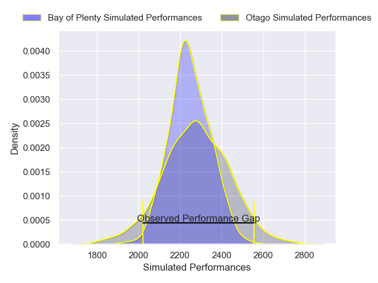
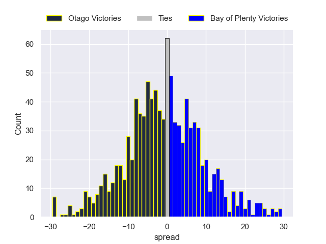

---  
layout: page  
title: Otago V Bay of Plenty on 2025/10/17  
date: 2025-10-17  
categories: "NPC 2025" match projection  
---
# Otago V Bay of Plenty on 2025/10/17, 41.0 to 17.0

# Club Level Predictions

Now that the game has been played, lets see how the club predictions did. I predicted Otago to win by 0.45, and Otago won by 24.0. That's an absolute error of 23.6 for the margin of victory, while my average absolute error has been 13.9 over the past six months. This prediction was more accurate than 17.3% of my recent predictions.

For the Over/Under model, I predicted a total of 58.5 and we have an actual total of 58.0. That's an absolute error of 0.5 compared to a six month average of 13.7. This prediction was more accurate than 97.1% of my recent predictions.
## Projected Performances - Club Model

## Projected Spreads - Club Model

## Projected Results - Club Model

