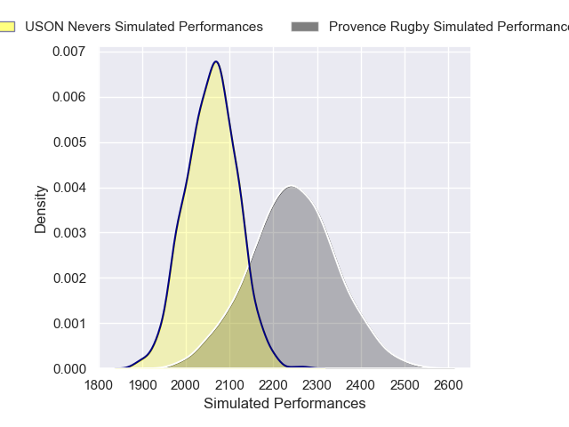
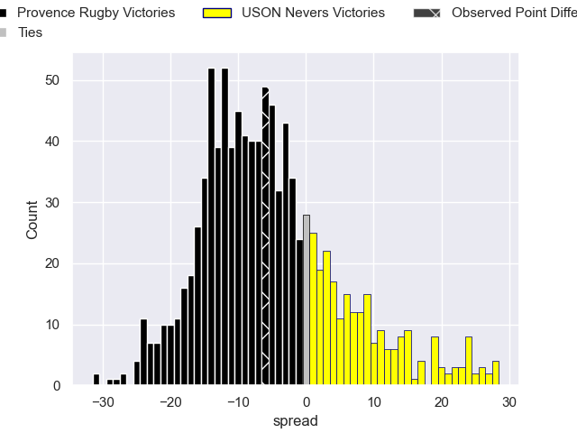

---  
layout: page  
title: Provence Rugby V USON Nevers on 2025/10/17  
date: 2025-10-17  
categories: "Pro D2 25/26" match projection  
---
# Provence Rugby V USON Nevers on 2025/10/17, 39.0 to 33.0

# Club Level Predictions

Now that the game has been played, lets see how the club predictions did. I predicted Provence Rugby to win by 5.61, and Provence Rugby won by 6.0. That's an absolute error of 0.4 for the margin of victory, while my average absolute error has been 13.9 over the past six months. This prediction was more accurate than 97.8% of my recent predictions.

For the Over/Under model, I predicted a total of 46.5 and we have an actual total of 72.0. That's an absolute error of 25.5 compared to a six month average of 13.7. This prediction was more accurate than 12.9% of my recent predictions.
## Projected Performances - Club Model

## Projected Spreads - Club Model

## Projected Results - Club Model

