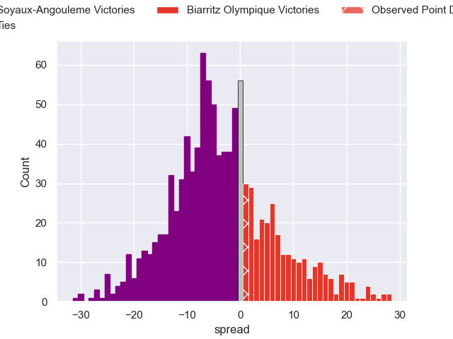

---  
layout: page  
title: Soyaux-Angouleme V Biarritz Olympique on 2025/10/17  
date: 2025-10-17  
categories: "Pro D2 25/26" match projection  
---
# Soyaux-Angouleme V Biarritz Olympique on 2025/10/17, 20.0 to 21.0

# Club Level Predictions

Now that the game has been played, lets see how the club predictions did. I predicted Soyaux-Angouleme to win by 3.86, and Biarritz Olympique won by 1.0. That's an absolute error of 4.9 for the margin of victory, while my average absolute error has been 13.9 over the past six months. This prediction was more accurate than 75.8% of my recent predictions.

For the Over/Under model, I predicted a total of 46.5 and we have an actual total of 41.0. That's an absolute error of 5.5 compared to a six month average of 13.7. This prediction was more accurate than 75.6% of my recent predictions.
## Projected Performances - Club Model

## Projected Spreads - Club Model

## Projected Results - Club Model

