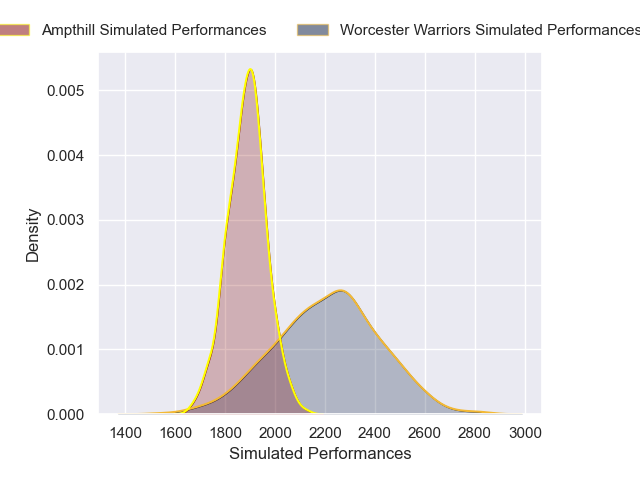
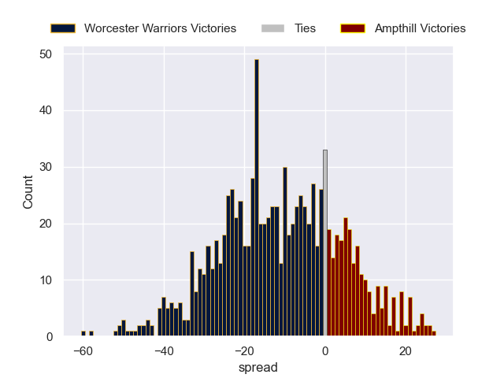

---  
layout: page  
title: Worcester Warriors V Ampthill on 2025/10/17  
date: 2025-10-17  
categories: "RFU Championship 25/26" match projection  
---
# Worcester Warriors V Ampthill on 2025/10/17, 56.0 to 28.0

# Club Level Predictions

Now that the game has been played, lets see how the club predictions did. I predicted Worcester Warriors to win by 11.44, and Worcester Warriors won by 28.0. That's an absolute error of 16.6 for the margin of victory, while my average absolute error has been 13.9 over the past six months. This prediction was more accurate than 30.9% of my recent predictions.

For the Over/Under model, I predicted a total of 57.5 and we have an actual total of 84.0. That's an absolute error of 26.5 compared to a six month average of 13.7. This prediction was more accurate than 11.9% of my recent predictions.
## Projected Performances - Club Model

## Projected Spreads - Club Model

## Projected Results - Club Model

