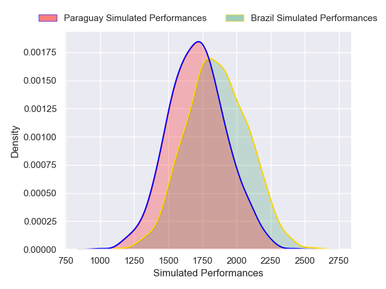
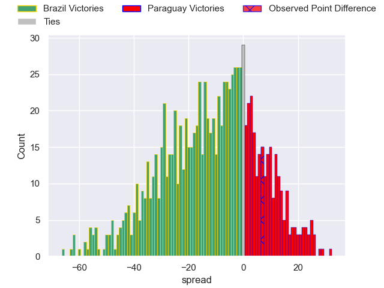

---  
layout: page  
title: Brazil V Paraguay on 2025/10/18  
date: 2025-10-18  
categories: "International Test Match 2025" match projection  
---
# Brazil V Paraguay on 2025/10/18, 24.0 to 31.0

# Club Level Predictions

Now that the game has been played, lets see how the club predictions did. I predicted Brazil to win by 12.84, and Paraguay won by 7.0. That's an absolute error of 19.8 for the margin of victory, while my average absolute error has been 13.9 over the past six months. This prediction was more accurate than 24.4% of my recent predictions.

For the Over/Under model, I predicted a total of 60.5 and we have an actual total of 55.0. That's an absolute error of 5.5 compared to a six month average of 13.7. This prediction was more accurate than 74.9% of my recent predictions.
## Projected Performances - Club Model

## Projected Spreads - Club Model

## Projected Results - Club Model

