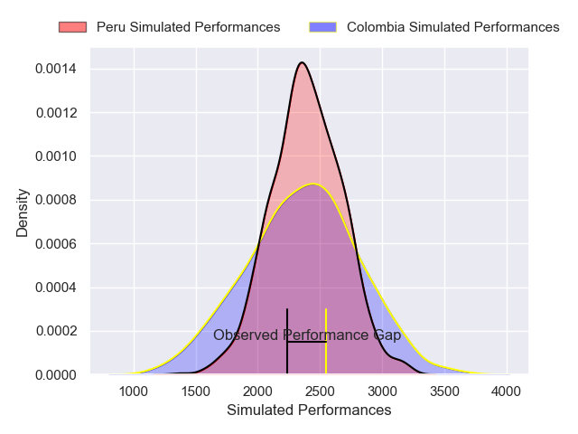
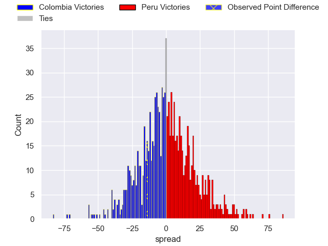

---  
layout: page  
title: Colombia V Peru on 2025/10/18  
date: 2025-10-18  
categories: "International Test Match 2025" match projection  
---
# Colombia V Peru on 2025/10/18, 38.0 to 24.0

# Club Level Predictions

Now that the game has been played, lets see how the club predictions did. I predicted Peru to win by 0.56, and Colombia won by 14.0. That's an absolute error of 14.6 for the margin of victory, while my average absolute error has been 13.9 over the past six months. This prediction was more accurate than 36.2% of my recent predictions.

For the Over/Under model, I predicted a total of 52.5 and we have an actual total of 62.0. That's an absolute error of 9.5 compared to a six month average of 13.7. This prediction was more accurate than 58.0% of my recent predictions.
## Projected Performances - Club Model

## Projected Spreads - Club Model

## Projected Results - Club Model

