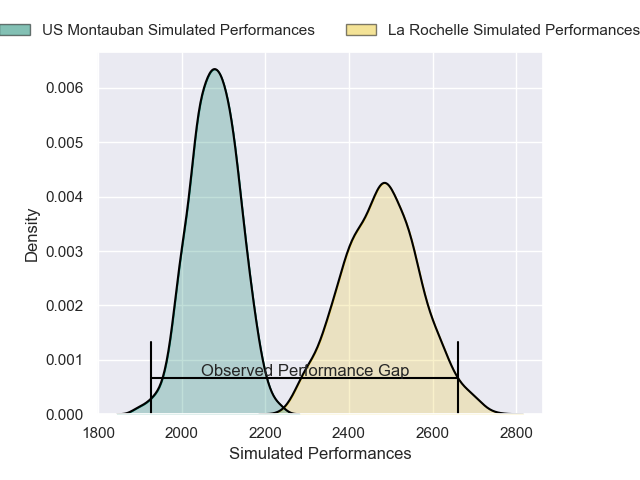
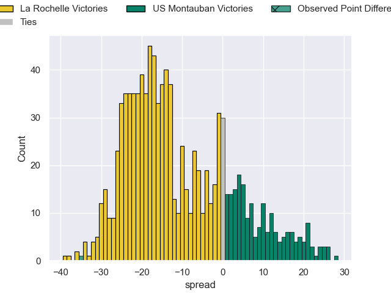
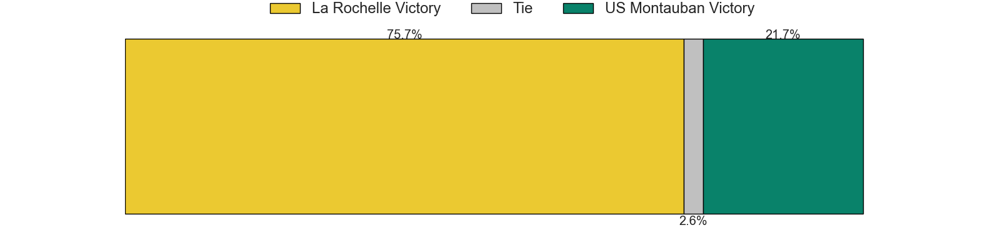

---  
layout: page  
title: La Rochelle V US Montauban on 2025/10/18  
date: 2025-10-18  
categories: "Top 14 25/26" match projection  
---
# La Rochelle V US Montauban on 2025/10/18, 54.0 to 19.0

# Club Level Predictions

Now that the game has been played, lets see how the club predictions did. I predicted La Rochelle to win by 11.01, and La Rochelle won by 35.0. That's an absolute error of 24.0 for the margin of victory, while my average absolute error has been 13.9 over the past six months. This prediction was more accurate than 16.5% of my recent predictions.

For the Over/Under model, I predicted a total of 54.5 and we have an actual total of 73.0. That's an absolute error of 18.5 compared to a six month average of 13.7. This prediction was more accurate than 27.4% of my recent predictions.
## Projected Performances - Club Model

## Projected Spreads - Club Model

## Projected Results - Club Model

