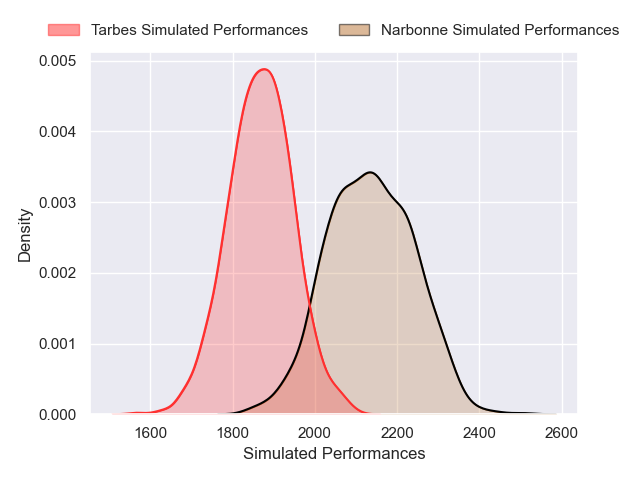
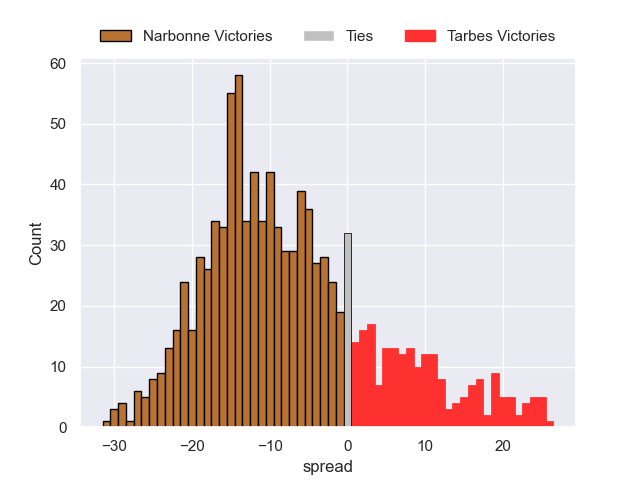
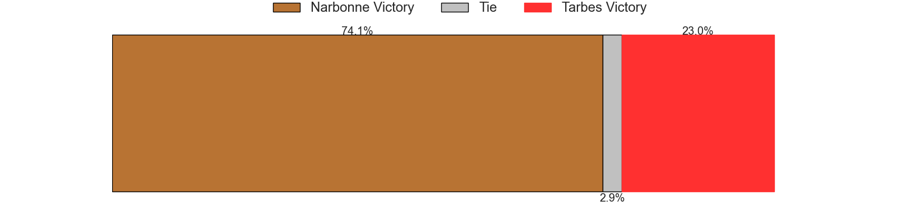

---  
layout: page  
title: Narbonne V Tarbes on 2025/10/18  
date: 2025-10-18  
categories: "Nationale 25/26" match projection  
---
# Narbonne V Tarbes on 2025/10/18, 41.0 to 17.0

# Club Level Predictions

Now that the game has been played, lets see how the club predictions did. I predicted Narbonne to win by 6.74, and Narbonne won by 24.0. That's an absolute error of 17.3 for the margin of victory, while my average absolute error has been 13.9 over the past six months. This prediction was more accurate than 29.4% of my recent predictions.

For the Over/Under model, I predicted a total of 42.5 and we have an actual total of 58.0. That's an absolute error of 15.5 compared to a six month average of 13.7. This prediction was more accurate than 35.7% of my recent predictions.
## Projected Performances - Club Model

## Projected Spreads - Club Model

## Projected Results - Club Model

