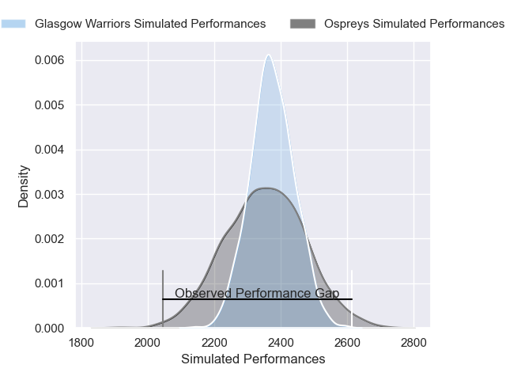
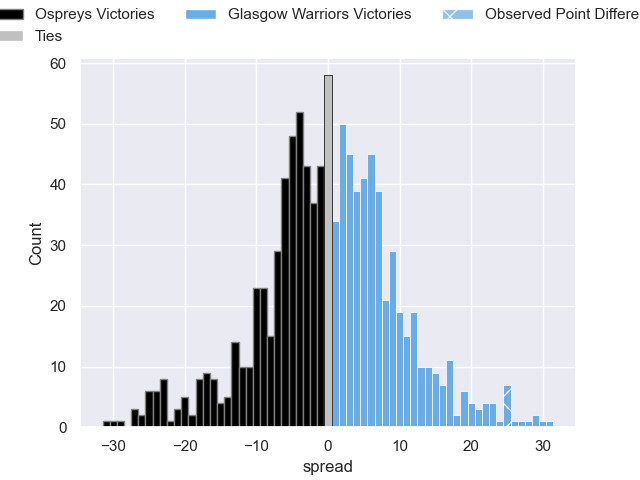

---  
layout: page  
title: Ospreys V Glasgow Warriors on 2025/10/18  
date: 2025-10-18  
categories: "United Rugby Championship 25/26" match projection  
---
# Ospreys V Glasgow Warriors on 2025/10/18, 17.0 to 42.0

# Club Level Predictions

Now that the game has been played, lets see how the club predictions did. I predicted Glasgow Warriors to win by 0.48, and Glasgow Warriors won by 25.0. That's an absolute error of 24.5 for the margin of victory, while my average absolute error has been 13.9 over the past six months. This prediction was more accurate than 15.8% of my recent predictions.

For the Over/Under model, I predicted a total of 47.5 and we have an actual total of 59.0. That's an absolute error of 11.5 compared to a six month average of 13.6. This prediction was more accurate than 49.0% of my recent predictions.
## Projected Performances - Club Model

## Projected Spreads - Club Model

## Projected Results - Club Model

