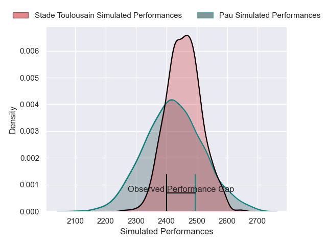
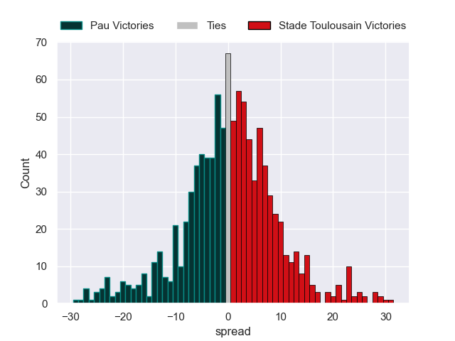

---  
layout: page  
title: Pau V Stade Toulousain on 2025/10/18  
date: 2025-10-18  
categories: "Top 14 25/26" match projection  
---
# Pau V Stade Toulousain on 2025/10/18, 30.0 to 26.0

# Club Level Predictions

Now that the game has been played, lets see how the club predictions did. I predicted Stade Toulousain to win by 1.3, and Pau won by 4.0. That's an absolute error of 5.3 for the margin of victory, while my average absolute error has been 13.9 over the past six months. This prediction was more accurate than 73.9% of my recent predictions.

For the Over/Under model, I predicted a total of 52.5 and we have an actual total of 56.0. That's an absolute error of 3.5 compared to a six month average of 13.7. This prediction was more accurate than 83.5% of my recent predictions.
## Projected Performances - Club Model

## Projected Spreads - Club Model

## Projected Results - Club Model

