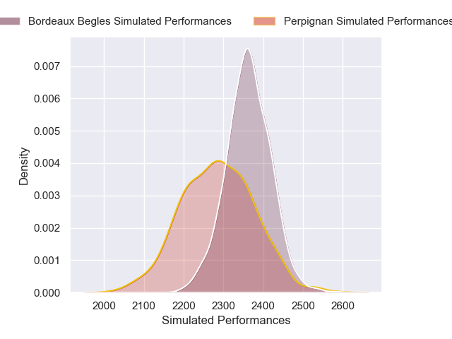
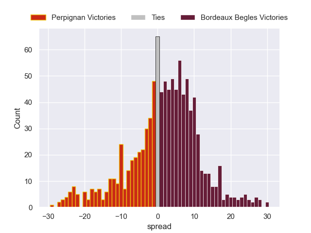

---  
layout: page  
title: Perpignan V Bordeaux Begles on 2025/10/17  
date: 2025-10-18  
categories: "Top 14 25/26" match projection  
---
# Perpignan V Bordeaux Begles on 2025/10/17, 12.0 to 27.0

# Club Level Predictions

Now that the game has been played, lets see how the club predictions did. I predicted Bordeaux Begles to win by 1.56, and Bordeaux Begles won by 15.0. That's an absolute error of 13.4 for the margin of victory, while my average absolute error has been 13.9 over the past six months. This prediction was more accurate than 38.5% of my recent predictions.

For the Over/Under model, I predicted a total of 50.5 and we have an actual total of 39.0. That's an absolute error of 11.5 compared to a six month average of 13.7. This prediction was more accurate than 49.0% of my recent predictions.
## Projected Performances - Club Model

## Projected Spreads - Club Model

## Projected Results - Club Model

