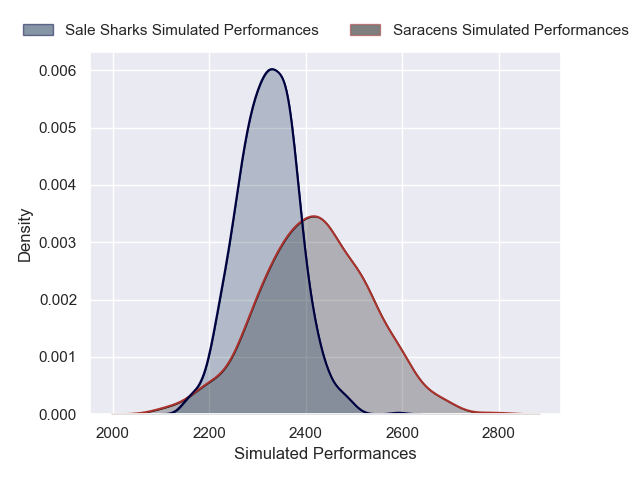
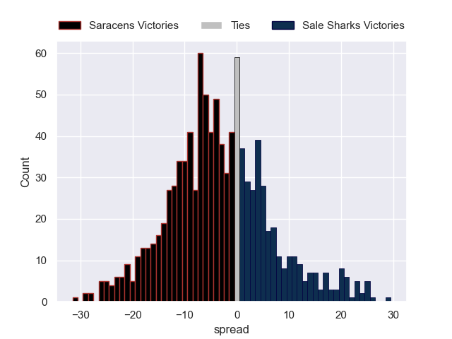

---  
layout: page  
title: Saracens V Sale Sharks on 2025/10/18  
date: 2025-10-18  
categories: "Gallagher Premiership 25/26" match projection  
---
# Saracens V Sale Sharks on 2025/10/18, 65.0 to 14.0

# Club Level Predictions

Now that the game has been played, lets see how the club predictions did. I predicted Saracens to win by 1.92, and Saracens won by 51.0. That's an absolute error of 49.1 for the margin of victory, while my average absolute error has been 13.9 over the past six months. This prediction was more accurate than 2.0% of my recent predictions.

For the Over/Under model, I predicted a total of 51.5 and we have an actual total of 79.0. That's an absolute error of 27.5 compared to a six month average of 13.7. This prediction was more accurate than 10.3% of my recent predictions.
## Projected Performances - Club Model

## Projected Spreads - Club Model

## Projected Results - Club Model

