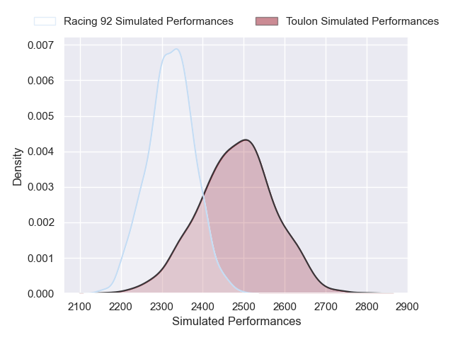
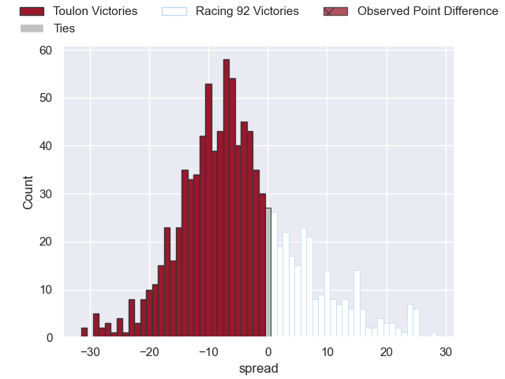

---  
layout: page  
title: Toulon V Racing 92 on 2025/10/19  
date: 2025-10-19  
categories: "Top 14 25/26" match projection  
---
# Toulon V Racing 92 on 2025/10/19, 45.0 to 21.0

# Club Level Predictions

Now that the game has been played, lets see how the club predictions did. I predicted Toulon to win by 4.74, and Toulon won by 24.0. That's an absolute error of 19.3 for the margin of victory, while my average absolute error has been 13.9 over the past six months. This prediction was more accurate than 26.0% of my recent predictions.

For the Over/Under model, I predicted a total of 46.5 and we have an actual total of 66.0. That's an absolute error of 19.5 compared to a six month average of 13.7. This prediction was more accurate than 24.9% of my recent predictions.
## Projected Performances - Club Model

## Projected Spreads - Club Model

## Projected Results - Club Model

