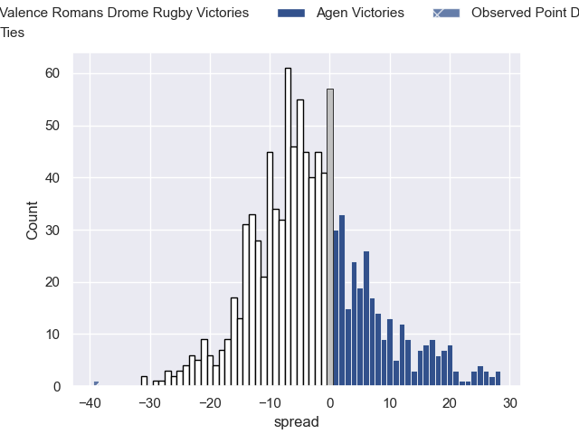

---  
layout: page  
title: Valence Romans Drome Rugby V Agen on 2025/10/23  
date: 2025-10-23  
categories: "Pro D2 25/26" match projection  
---
# Valence Romans Drome Rugby V Agen on 2025/10/23, 56.0 to 17.0

# Club Level Predictions

Now that the game has been played, lets see how the club predictions did. I predicted Valence Romans Drome Rugby to win by 3.08, and Valence Romans Drome Rugby won by 39.0. That's an absolute error of 35.9 for the margin of victory, while my average absolute error has been 13.9 over the past six months. This prediction was more accurate than 5.8% of my recent predictions.

For the Over/Under model, I predicted a total of 49.5 and we have an actual total of 73.0. That's an absolute error of 23.5 compared to a six month average of 13.6. This prediction was more accurate than 16.7% of my recent predictions.
## Projected Performances - Club Model

## Projected Spreads - Club Model

## Projected Results - Club Model

