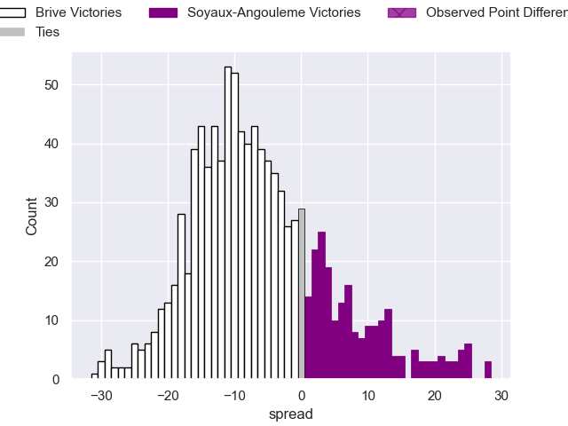

---  
layout: page  
title: Brive V Soyaux-Angouleme on 2025/10/24  
date: 2025-10-24  
categories: "Pro D2 25/26" match projection  
---
# Brive V Soyaux-Angouleme on 2025/10/24, 16.0 to 25.0

# Club Level Predictions

Now that the game has been played, lets see how the club predictions did. I predicted Brive to win by 6.26, and Soyaux-Angouleme won by 9.0. That's an absolute error of 15.3 for the margin of victory, while my average absolute error has been 13.9 over the past six months. This prediction was more accurate than 34.4% of my recent predictions.

For the Over/Under model, I predicted a total of 45.5 and we have an actual total of 41.0. That's an absolute error of 4.5 compared to a six month average of 13.6. This prediction was more accurate than 79.9% of my recent predictions.
## Projected Performances - Club Model

## Projected Spreads - Club Model

## Projected Results - Club Model

