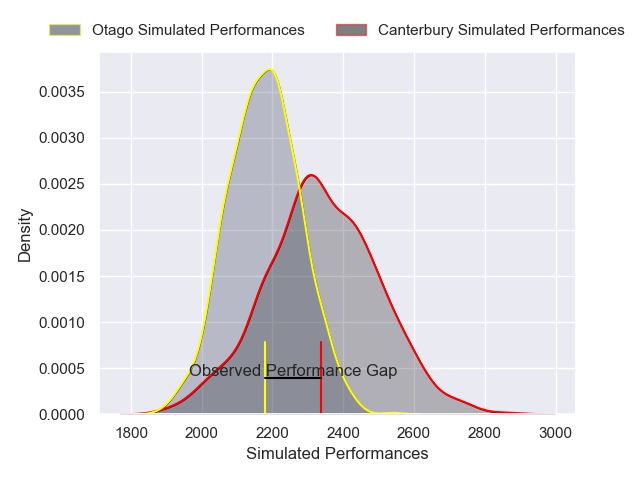
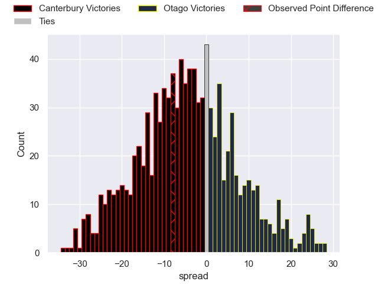

---  
layout: page  
title: Canterbury V Otago on 2025/10/24  
date: 2025-10-24  
categories: "NPC 2025" match projection  
---
# Canterbury V Otago on 2025/10/24, 36.0 to 28.0

# Club Level Predictions

Now that the game has been played, lets see how the club predictions did. I predicted Canterbury to win by 4.45, and Canterbury won by 8.0. That's an absolute error of 3.6 for the margin of victory, while my average absolute error has been 13.9 over the past six months. This prediction was more accurate than 82.9% of my recent predictions.

For the Over/Under model, I predicted a total of 55.5 and we have an actual total of 64.0. That's an absolute error of 8.5 compared to a six month average of 13.5. This prediction was more accurate than 60.3% of my recent predictions.
## Projected Performances - Club Model

## Projected Spreads - Club Model

## Projected Results - Club Model

