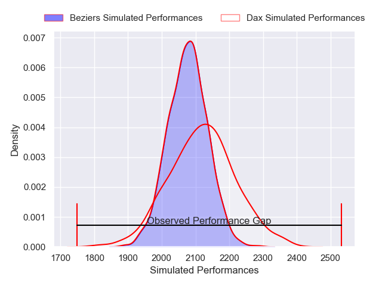

---  
layout: page  
title: Dax V Beziers on 2025/10/24  
date: 2025-10-24  
categories: "Pro D2 25/26" match projection  
---
# Dax V Beziers on 2025/10/24, 40.0 to 5.0

# Club Level Predictions

Now that the game has been played, lets see how the club predictions did. I predicted Dax to win by 0.87, and Dax won by 35.0. That's an absolute error of 34.1 for the margin of victory, while my average absolute error has been 13.9 over the past six months. This prediction was more accurate than 7.1% of my recent predictions.

For the Over/Under model, I predicted a total of 49.5 and we have an actual total of 45.0. That's an absolute error of 4.5 compared to a six month average of 13.5. This prediction was more accurate than 78.8% of my recent predictions.
## Projected Performances - Club Model

## Projected Spreads - Club Model

## Projected Results - Club Model

