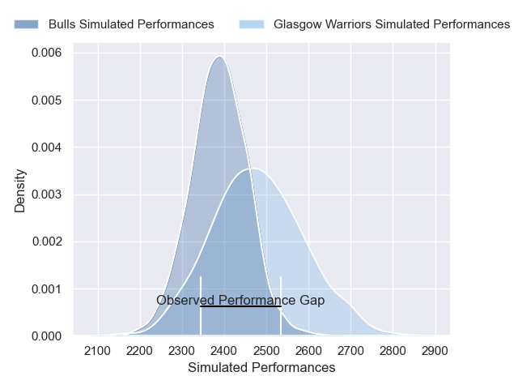
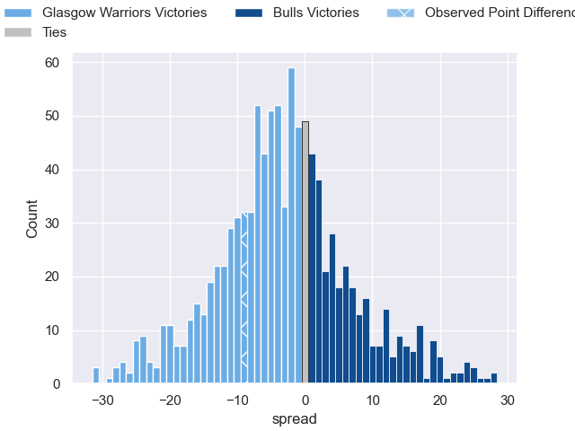

---  
layout: page  
title: Glasgow Warriors V Bulls on 2025/10/24  
date: 2025-10-24  
categories: "United Rugby Championship 25/26" match projection  
---
# Glasgow Warriors V Bulls on 2025/10/24, 21.0 to 12.0

# Club Level Predictions

Now that the game has been played, lets see how the club predictions did. I predicted Glasgow Warriors to win by 3.18, and Glasgow Warriors won by 9.0. That's an absolute error of 5.8 for the margin of victory, while my average absolute error has been 13.9 over the past six months. This prediction was more accurate than 71.5% of my recent predictions.

For the Over/Under model, I predicted a total of 51.5 and we have an actual total of 33.0. That's an absolute error of 18.5 compared to a six month average of 13.6. This prediction was more accurate than 26.8% of my recent predictions.
## Projected Performances - Club Model

## Projected Spreads - Club Model

## Projected Results - Club Model

