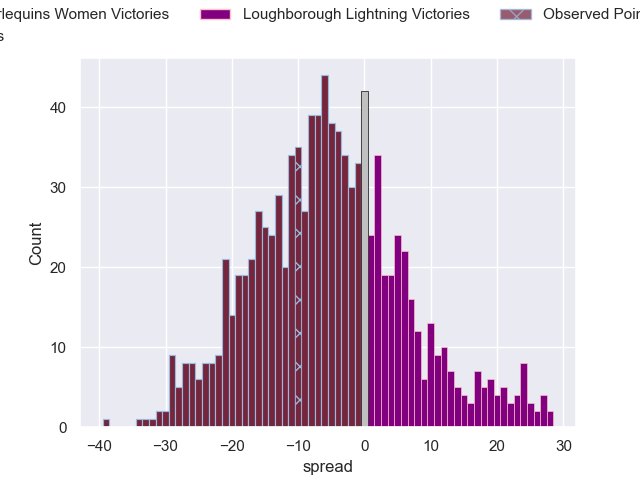

---  
layout: page  
title: Harlequins Ladies V Loughborough Lightning on 2025/10/24  
date: 2025-10-24  
categories: "PWR 25/26" match projection  
---
# Harlequins Ladies V Loughborough Lightning on 2025/10/24, 52.0 to 42.0

# Club Level Predictions

Now that the game has been played, lets see how the club predictions did. I predicted Harlequins Women to win by 5.19, and Harlequins Women won by 10.0. That's an absolute error of 4.8 for the margin of victory, while my average absolute error has been 13.9 over the past six months. This prediction was more accurate than 75.4% of my recent predictions.

For the Over/Under model, I predicted a total of 53.5 and we have an actual total of 94.0. That's an absolute error of 40.5 compared to a six month average of 13.6. This prediction was more accurate than 3.2% of my recent predictions.
## Projected Performances - Club Model

## Projected Spreads - Club Model

## Projected Results - Club Model

