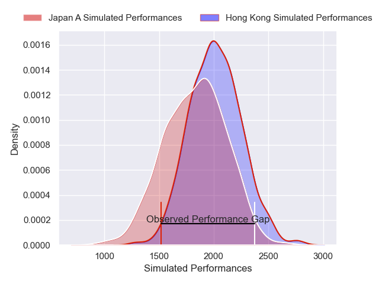
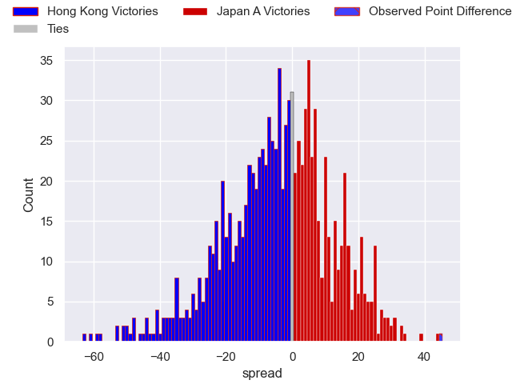

---  
layout: page  
title: Hong Kong V Japan A on 2025/10/24  
date: 2025-10-24  
categories: "International Test Match 2025" match projection  
---
# Hong Kong V Japan A on 2025/10/24, 14.0 to 59.0

# Club Level Predictions

Now that the game has been played, lets see how the club predictions did. I predicted Hong Kong to win by 4.61, and Japan A won by 45.0. That's an absolute error of 49.6 for the margin of victory, while my average absolute error has been 13.9 over the past six months. This prediction was more accurate than 2.1% of my recent predictions.

For the Over/Under model, I predicted a total of 58.5 and we have an actual total of 73.0. That's an absolute error of 14.5 compared to a six month average of 13.6. This prediction was more accurate than 37.8% of my recent predictions.
## Projected Performances - Club Model

## Projected Spreads - Club Model

## Projected Results - Club Model

