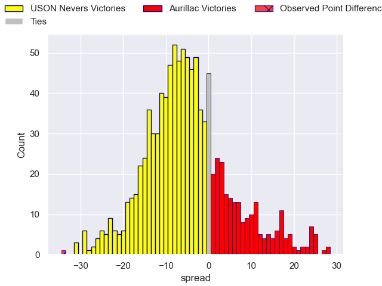
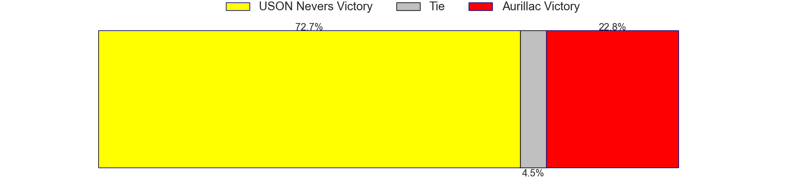

---  
layout: page  
title: USON Nevers V Aurillac on 2025/10/24  
date: 2025-10-24  
categories: "Pro D2 25/26" match projection  
---
# USON Nevers V Aurillac on 2025/10/24, 62.0 to 28.0

# Club Level Predictions

Now that the game has been played, lets see how the club predictions did. I predicted USON Nevers to win by 4.52, and USON Nevers won by 34.0. That's an absolute error of 29.5 for the margin of victory, while my average absolute error has been 13.9 over the past six months. This prediction was more accurate than 10.0% of my recent predictions.

For the Over/Under model, I predicted a total of 49.5 and we have an actual total of 90.0. That's an absolute error of 40.5 compared to a six month average of 13.5. This prediction was more accurate than 3.3% of my recent predictions.
## Projected Performances - Club Model

## Projected Spreads - Club Model

## Projected Results - Club Model

