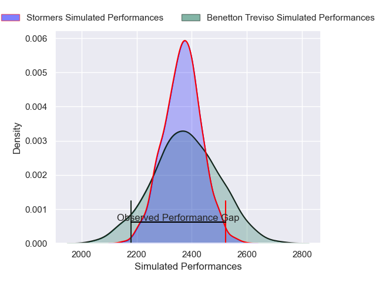
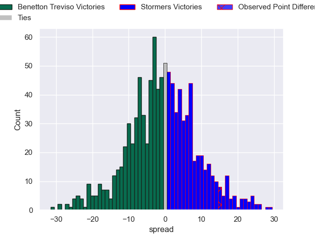

---  
layout: page  
title: Benetton Treviso V Stormers on 2025/10/25  
date: 2025-10-25  
categories: "United Rugby Championship 25/26" match projection  
---
# Benetton Treviso V Stormers on 2025/10/25, 16.0 to 31.0

# Club Level Predictions

Now that the game has been played, lets see how the club predictions did. I predicted Benetton Treviso to win by 0.68, and Stormers won by 15.0. That's an absolute error of 15.7 for the margin of victory, while my average absolute error has been 13.9 over the past six months. This prediction was more accurate than 33.2% of my recent predictions.

For the Over/Under model, I predicted a total of 49.5 and we have an actual total of 47.0. That's an absolute error of 2.5 compared to a six month average of 13.6. This prediction was more accurate than 88.6% of my recent predictions.
## Projected Performances - Club Model

## Projected Spreads - Club Model

## Projected Results - Club Model

