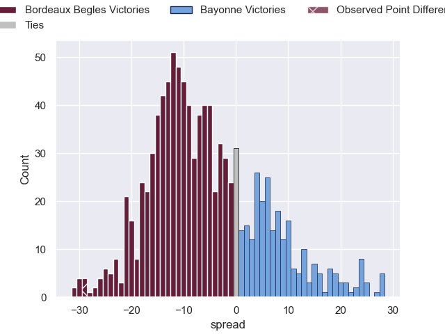

---  
layout: page  
title: Bordeaux Begles V Bayonne on 2025/10/25  
date: 2025-10-25  
categories: "Top 14 25/26" match projection  
---
# Bordeaux Begles V Bayonne on 2025/10/25, 41.0 to 12.0

# Club Level Predictions

Now that the game has been played, lets see how the club predictions did. I predicted Bordeaux Begles to win by 6.39, and Bordeaux Begles won by 29.0. That's an absolute error of 22.6 for the margin of victory, while my average absolute error has been 13.9 over the past six months. This prediction was more accurate than 18.8% of my recent predictions.

For the Over/Under model, I predicted a total of 51.5 and we have an actual total of 53.0. That's an absolute error of 1.5 compared to a six month average of 13.5. This prediction was more accurate than 92.2% of my recent predictions.
## Projected Performances - Club Model

## Projected Spreads - Club Model

## Projected Results - Club Model

