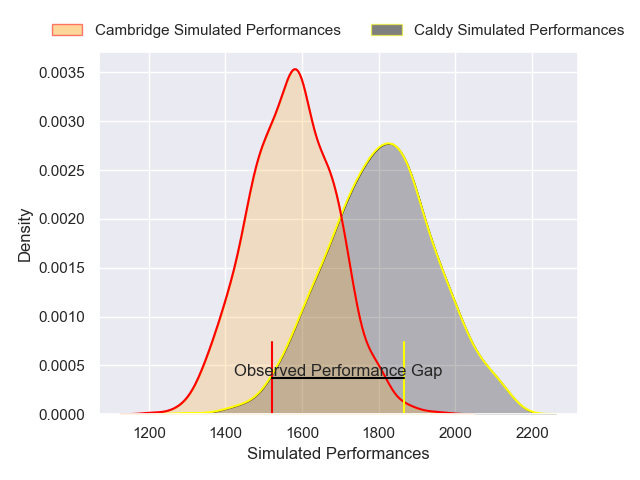
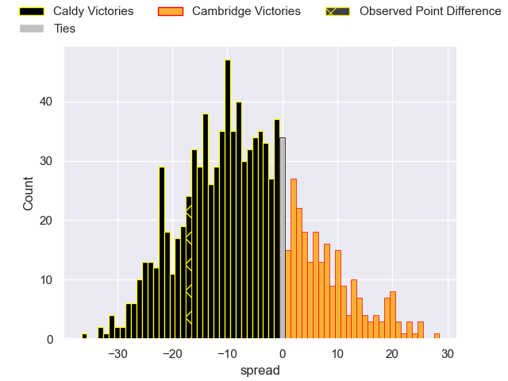

---  
layout: page  
title: Caldy V Cambridge on 2025/10/25  
date: 2025-10-25  
categories: "RFU Championship 25/26" match projection  
---
# Caldy V Cambridge on 2025/10/25, 41.0 to 24.0

# Club Level Predictions

Now that the game has been played, lets see how the club predictions did. I predicted Caldy to win by 6.74, and Caldy won by 17.0. That's an absolute error of 10.3 for the margin of victory, while my average absolute error has been 13.9 over the past six months. This prediction was more accurate than 50.2% of my recent predictions.

For the Over/Under model, I predicted a total of 61.5 and we have an actual total of 65.0. That's an absolute error of 3.5 compared to a six month average of 13.6. This prediction was more accurate than 84.6% of my recent predictions.
## Projected Performances - Club Model

## Projected Spreads - Club Model

## Projected Results - Club Model

