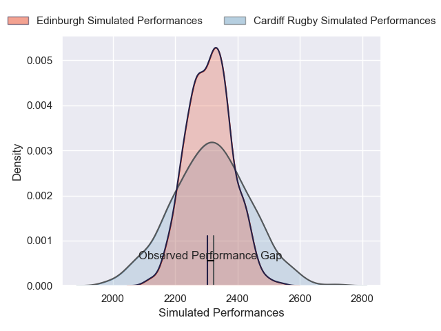
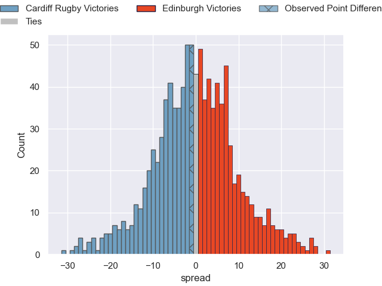

---  
layout: page  
title: Cardiff Rugby V Edinburgh on 2025/10/25  
date: 2025-10-25  
categories: "United Rugby Championship 25/26" match projection  
---
# Cardiff Rugby V Edinburgh on 2025/10/25, 20.0 to 19.0

# Club Level Predictions

Now that the game has been played, lets see how the club predictions did. I predicted Cardiff Rugby to win by 0.42, and Cardiff Rugby won by 1.0. That's an absolute error of 0.6 for the margin of victory, while my average absolute error has been 13.9 over the past six months. This prediction was more accurate than 96.8% of my recent predictions.

For the Over/Under model, I predicted a total of 48.5 and we have an actual total of 39.0. That's an absolute error of 9.5 compared to a six month average of 13.5. This prediction was more accurate than 55.6% of my recent predictions.
## Projected Performances - Club Model

## Projected Spreads - Club Model

## Projected Results - Club Model

