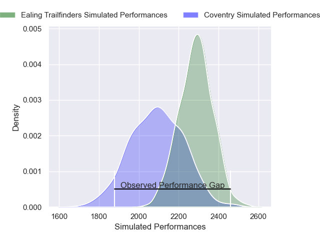
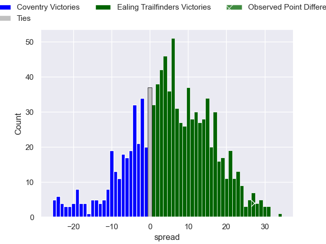

---  
layout: page  
title: Coventry V Ealing Trailfinders on 2025/10/25  
date: 2025-10-25  
categories: "RFU Championship 25/26" match projection  
---
# Coventry V Ealing Trailfinders on 2025/10/25, 36.0 to 63.0

# Club Level Predictions

Now that the game has been played, lets see how the club predictions did. I predicted Ealing Trailfinders to win by 5.16, and Ealing Trailfinders won by 27.0. That's an absolute error of 21.8 for the margin of victory, while my average absolute error has been 13.9 over the past six months. This prediction was more accurate than 20.1% of my recent predictions.

For the Over/Under model, I predicted a total of 63.5 and we have an actual total of 99.0. That's an absolute error of 35.5 compared to a six month average of 13.5. This prediction was more accurate than 3.9% of my recent predictions.
## Projected Performances - Club Model

## Projected Spreads - Club Model

## Projected Results - Club Model

