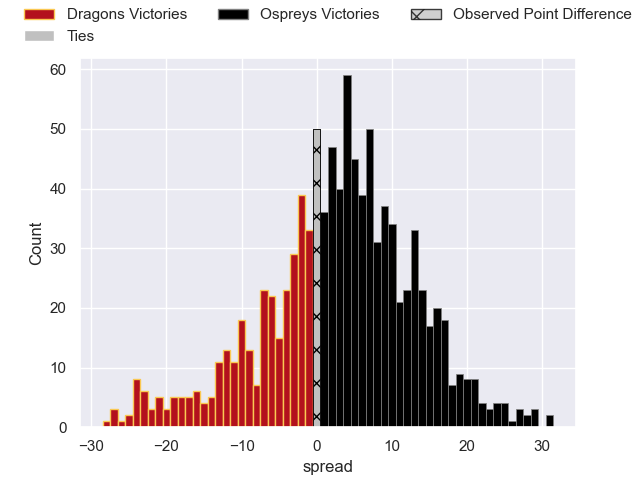

---  
layout: page  
title: Dragons V Ospreys on 2025/10/25  
date: 2025-10-25  
categories: "United Rugby Championship 25/26" match projection  
---
# Dragons V Ospreys on 2025/10/25, 19.0 to 19.0

# Club Level Predictions

Now that the game has been played, lets see how the club predictions did. I predicted Ospreys to win by 2.97, and Ospreys won by 0.0. That's an absolute error of 3.0 for the margin of victory, while my average absolute error has been 13.9 over the past six months. This prediction was more accurate than 85.6% of my recent predictions.

For the Over/Under model, I predicted a total of 54.5 and we have an actual total of 38.0. That's an absolute error of 16.5 compared to a six month average of 13.6. This prediction was more accurate than 31.5% of my recent predictions.
## Projected Performances - Club Model

## Projected Spreads - Club Model

## Projected Results - Club Model

