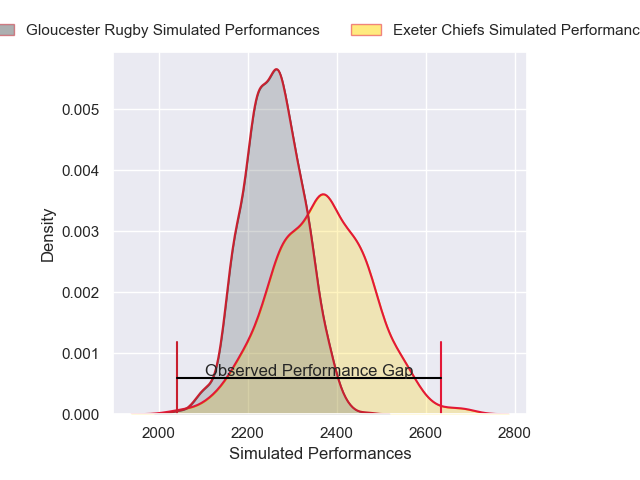
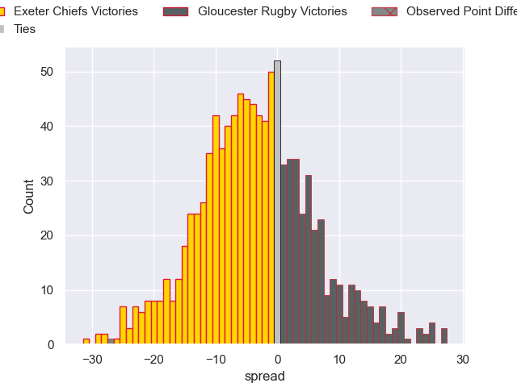

---  
layout: page  
title: Exeter Chiefs V Gloucester Rugby on 2025/10/25  
date: 2025-10-25  
categories: "Gallagher Premiership 25/26" match projection  
---
# Exeter Chiefs V Gloucester Rugby on 2025/10/25, 39.0 to 12.0

# Club Level Predictions

Now that the game has been played, lets see how the club predictions did. I predicted Exeter Chiefs to win by 3.36, and Exeter Chiefs won by 27.0. That's an absolute error of 23.6 for the margin of victory, while my average absolute error has been 13.9 over the past six months. This prediction was more accurate than 17.0% of my recent predictions.

For the Over/Under model, I predicted a total of 52.5 and we have an actual total of 51.0. That's an absolute error of 1.5 compared to a six month average of 13.6. This prediction was more accurate than 92.4% of my recent predictions.
## Projected Performances - Club Model

## Projected Spreads - Club Model

## Projected Results - Club Model

