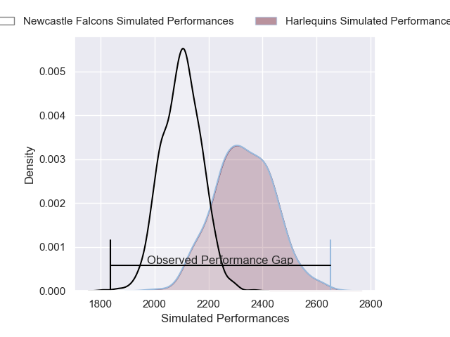
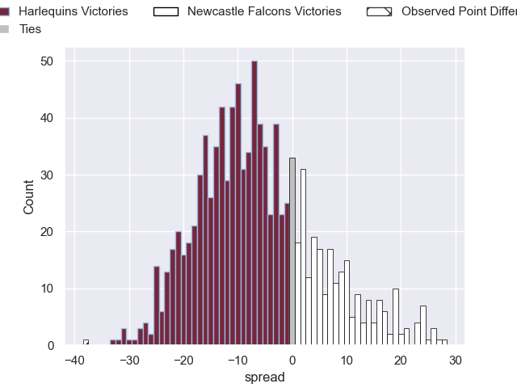

---  
layout: page  
title: Harlequins V Newcastle Falcons on 2025/10/25  
date: 2025-10-25  
categories: "Gallagher Premiership 25/26" match projection  
---
# Harlequins V Newcastle Falcons on 2025/10/25, 52.0 to 14.0

# Club Level Predictions

Now that the game has been played, lets see how the club predictions did. I predicted Harlequins to win by 6.31, and Harlequins won by 38.0. That's an absolute error of 31.7 for the margin of victory, while my average absolute error has been 13.9 over the past six months. This prediction was more accurate than 8.3% of my recent predictions.

For the Over/Under model, I predicted a total of 51.5 and we have an actual total of 66.0. That's an absolute error of 14.5 compared to a six month average of 13.6. This prediction was more accurate than 38.0% of my recent predictions.
## Projected Performances - Club Model

## Projected Spreads - Club Model

## Projected Results - Club Model

