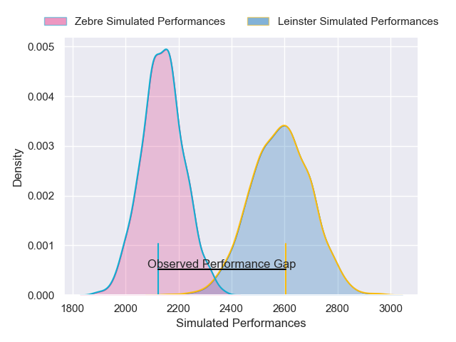

---  
layout: page  
title: Leinster V Zebre on 2025/10/25  
date: 2025-10-25  
categories: "United Rugby Championship 25/26" match projection  
---
# Leinster V Zebre on 2025/10/25, 50.0 to 26.0

# Club Level Predictions

Now that the game has been played, lets see how the club predictions did. I predicted Leinster to win by 12.32, and Leinster won by 24.0. That's an absolute error of 11.7 for the margin of victory, while my average absolute error has been 13.9 over the past six months. This prediction was more accurate than 45.8% of my recent predictions.

For the Over/Under model, I predicted a total of 49.5 and we have an actual total of 76.0. That's an absolute error of 26.5 compared to a six month average of 13.6. This prediction was more accurate than 11.4% of my recent predictions.
## Projected Performances - Club Model

## Projected Spreads - Club Model

## Projected Results - Club Model

