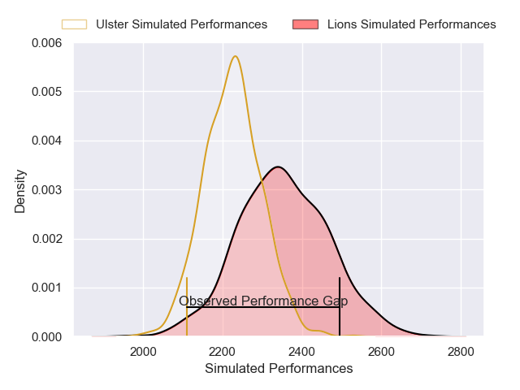
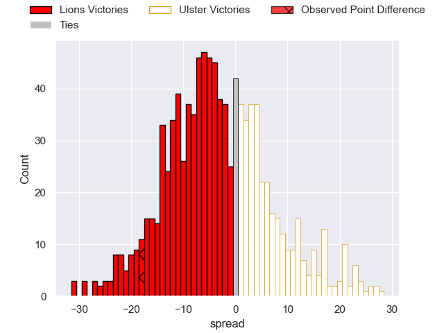

---  
layout: page  
title: Lions V Ulster on 2025/10/25  
date: 2025-10-25  
categories: "United Rugby Championship 25/26" match projection  
---
# Lions V Ulster on 2025/10/25, 49.0 to 31.0

# Club Level Predictions

Now that the game has been played, lets see how the club predictions did. I predicted Lions to win by 3.04, and Lions won by 18.0. That's an absolute error of 15.0 for the margin of victory, while my average absolute error has been 13.9 over the past six months. This prediction was more accurate than 35.7% of my recent predictions.

For the Over/Under model, I predicted a total of 51.5 and we have an actual total of 80.0. That's an absolute error of 28.5 compared to a six month average of 13.5. This prediction was more accurate than 8.6% of my recent predictions.
## Projected Performances - Club Model

## Projected Spreads - Club Model

## Projected Results - Club Model

