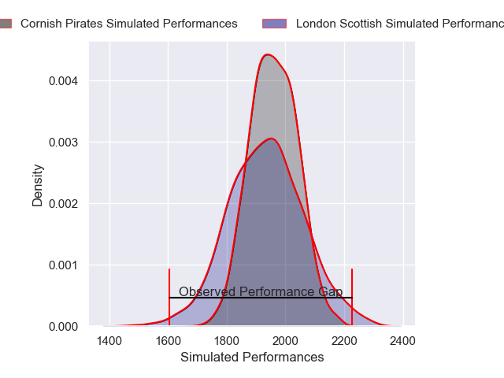
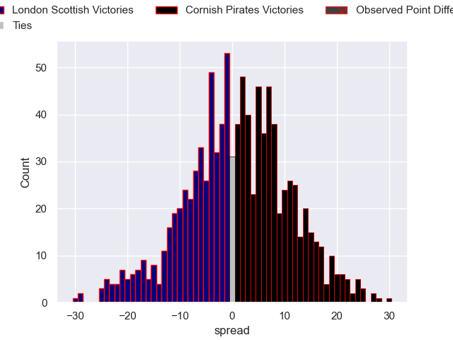

---  
layout: page  
title: London Scottish V Cornish Pirates on 2025/10/25  
date: 2025-10-25  
categories: "RFU Championship 25/26" match projection  
---
# London Scottish V Cornish Pirates on 2025/10/25, 10.0 to 38.0

# Club Level Predictions

Now that the game has been played, lets see how the club predictions did. I predicted Cornish Pirates to win by 0.62, and Cornish Pirates won by 28.0. That's an absolute error of 27.4 for the margin of victory, while my average absolute error has been 13.9 over the past six months. This prediction was more accurate than 12.4% of my recent predictions.

For the Over/Under model, I predicted a total of 50.5 and we have an actual total of 48.0. That's an absolute error of 2.5 compared to a six month average of 13.5. This prediction was more accurate than 88.1% of my recent predictions.
## Projected Performances - Club Model

## Projected Spreads - Club Model

## Projected Results - Club Model

