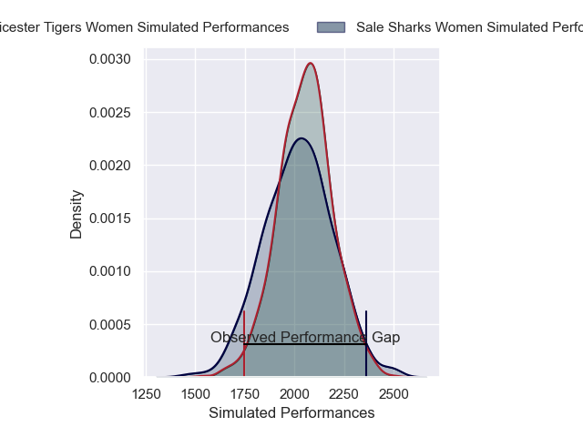

---  
layout: page  
title: Sale Sharks Women V Leicester Tigers Women on 2025/10/25  
date: 2025-10-25  
categories: "PWR 25/26" match projection  
---
# Sale Sharks Women V Leicester Tigers Women on 2025/10/25, 46.0 to 17.0

# Club Level Predictions

Now that the game has been played, lets see how the club predictions did. I predicted Leicester Tigers Women to win by 0.41, and Sale Sharks Women won by 29.0. That's an absolute error of 29.4 for the margin of victory, while my average absolute error has been 13.9 over the past six months. This prediction was more accurate than 10.0% of my recent predictions.

For the Over/Under model, I predicted a total of 58.5 and we have an actual total of 63.0. That's an absolute error of 4.5 compared to a six month average of 13.5. This prediction was more accurate than 78.8% of my recent predictions.
## Projected Performances - Club Model

## Projected Spreads - Club Model

## Projected Results - Club Model

