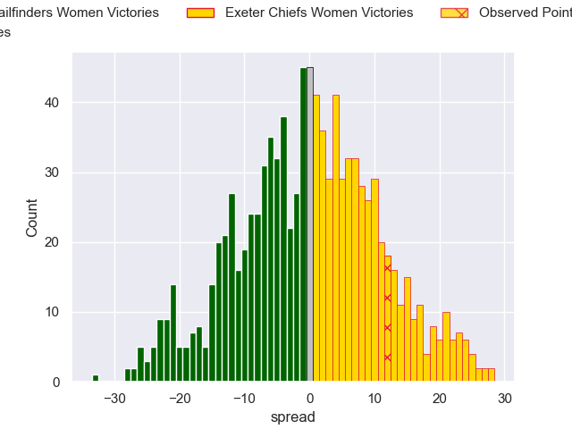

---  
layout: page  
title: Trailfinders Women V Exeter Chiefs Women on 2025/10/25  
date: 2025-10-25  
categories: "PWR 25/26" match projection  
---
# Trailfinders Women V Exeter Chiefs Women on 2025/10/25, 12.0 to 24.0

# Club Level Predictions

Now that the game has been played, lets see how the club predictions did. I predicted Trailfinders Women to win by 0.71, and Exeter Chiefs Women won by 12.0. That's an absolute error of 12.7 for the margin of victory, while my average absolute error has been 13.9 over the past six months. This prediction was more accurate than 41.9% of my recent predictions.

For the Over/Under model, I predicted a total of 55.5 and we have an actual total of 36.0. That's an absolute error of 19.5 compared to a six month average of 13.5. This prediction was more accurate than 24.2% of my recent predictions.
## Projected Performances - Club Model

## Projected Spreads - Club Model

## Projected Results - Club Model

