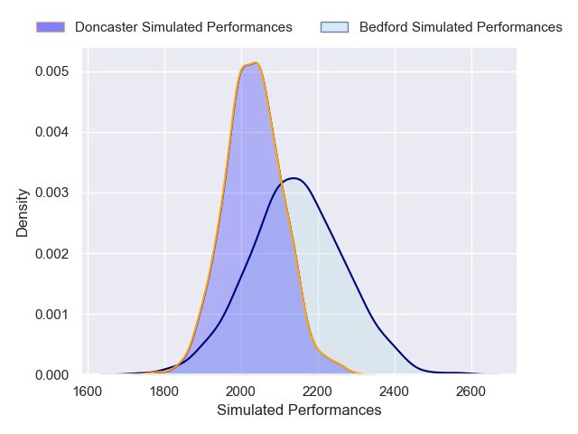
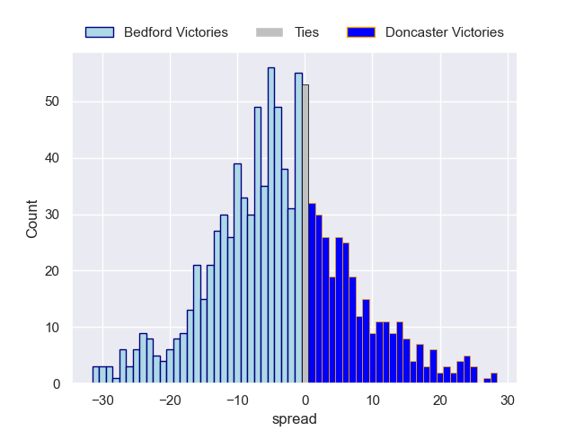

---  
layout: page  
title: Bedford V Doncaster on 2025/10/31  
date: 2025-10-31  
categories: "RFU Championship 25/26" match projection  
---
# Bedford V Doncaster on 2025/10/31, 36.0 to 32.0

# Club Level Predictions

Now that the game has been played, lets see how the club predictions did. I predicted Bedford to win by 2.75, and Bedford won by 4.0. That's an absolute error of 1.2 for the margin of victory, while my average absolute error has been 13.9 over the past six months. This prediction was more accurate than 92.8% of my recent predictions.

For the Over/Under model, I predicted a total of 55.5 and we have an actual total of 68.0. That's an absolute error of 12.5 compared to a six month average of 13.4. This prediction was more accurate than 44.1% of my recent predictions.
## Projected Performances - Club Model

## Projected Spreads - Club Model

## Projected Results - Club Model

