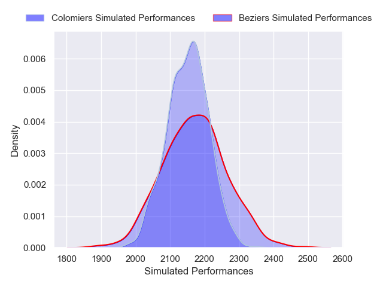
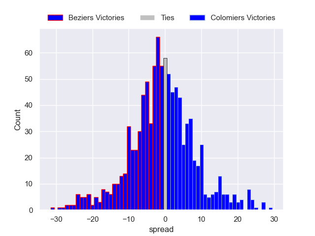

---  
layout: page  
title: Beziers V Colomiers on 2025/10/31  
date: 2025-10-31  
categories: "Pro D2 25/26" match projection  
---
# Beziers V Colomiers on 2025/10/31, 22.0 to 43.0

# Club Level Predictions

Now that the game has been played, lets see how the club predictions did. I predicted Beziers to win by 1.45, and Colomiers won by 21.0. That's an absolute error of 22.4 for the margin of victory, while my average absolute error has been 13.9 over the past six months. This prediction was more accurate than 19.7% of my recent predictions.

For the Over/Under model, I predicted a total of 46.5 and we have an actual total of 65.0. That's an absolute error of 18.5 compared to a six month average of 13.4. This prediction was more accurate than 25.9% of my recent predictions.
## Projected Performances - Club Model

## Projected Spreads - Club Model

## Projected Results - Club Model

