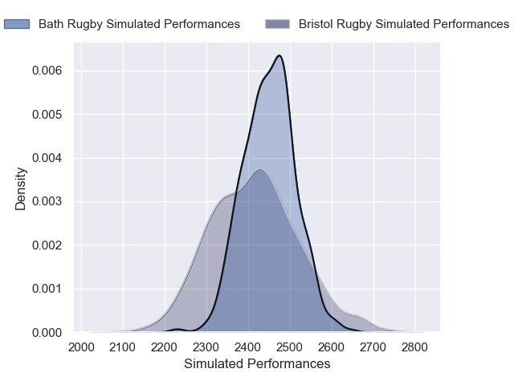
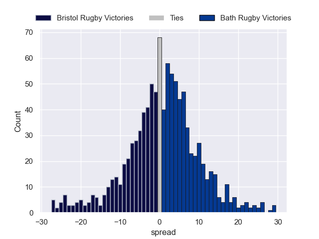

---  
layout: page  
title: Bristol Rugby V Bath Rugby on 2025/10/31  
date: 2025-10-31  
categories: "Premiership Rugby Cup 25/26" match projection  
---
# Bristol Rugby V Bath Rugby on 2025/10/31, 19.0 to 49.0

# Club Level Predictions

Now that the game has been played, lets see how the club predictions did. I predicted Bath Rugby to win by 0.24, and Bath Rugby won by 30.0. That's an absolute error of 29.8 for the margin of victory, while my average absolute error has been 13.9 over the past six months. This prediction was more accurate than 10.2% of my recent predictions.

For the Over/Under model, I predicted a total of 56.5 and we have an actual total of 68.0. That's an absolute error of 11.5 compared to a six month average of 13.5. This prediction was more accurate than 48.2% of my recent predictions.
## Projected Performances - Club Model

## Projected Spreads - Club Model

## Projected Results - Club Model

